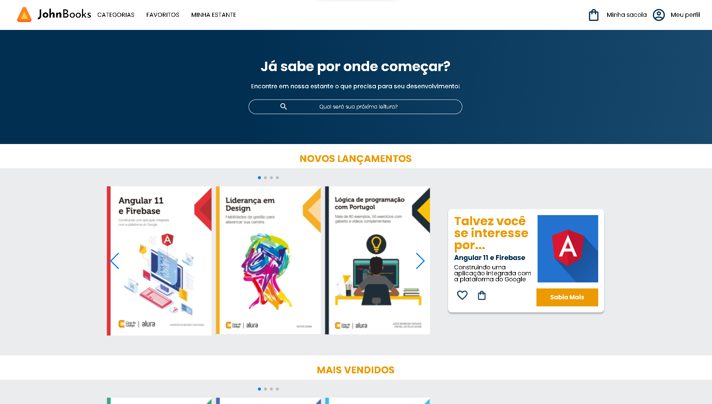
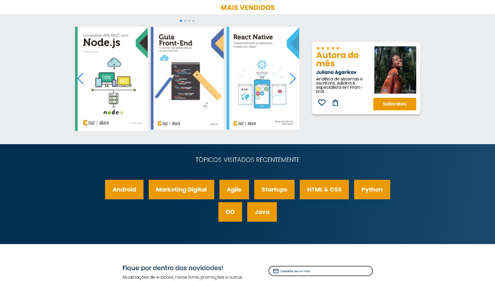
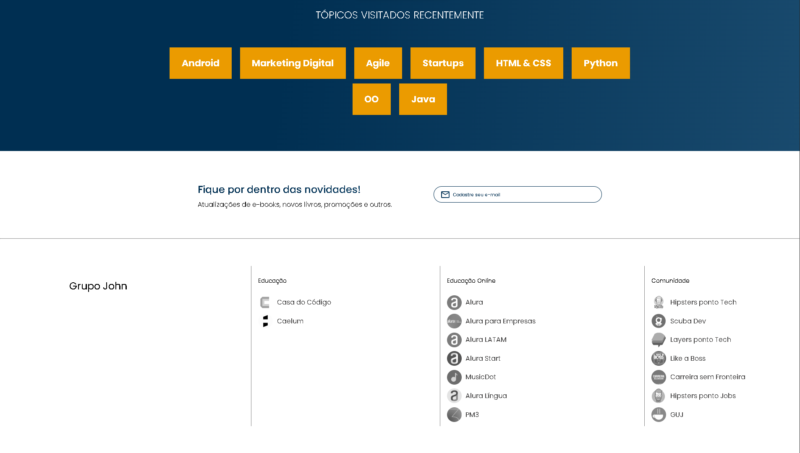
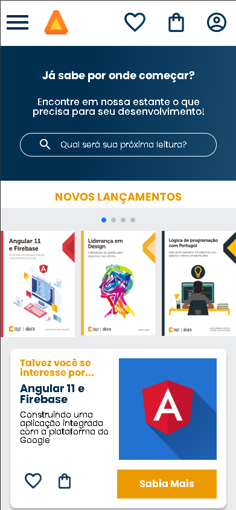
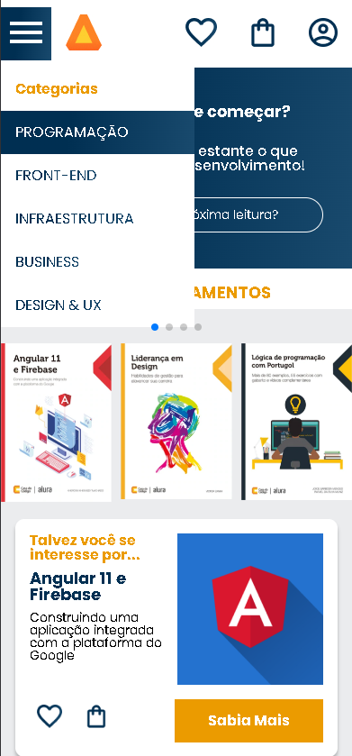
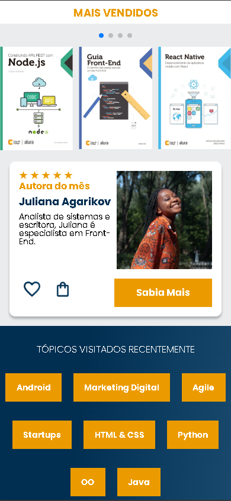
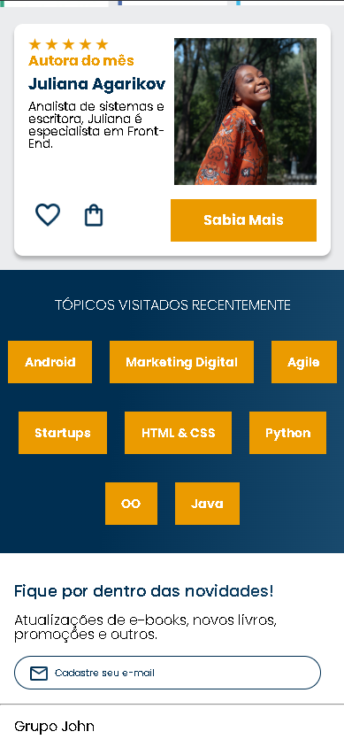
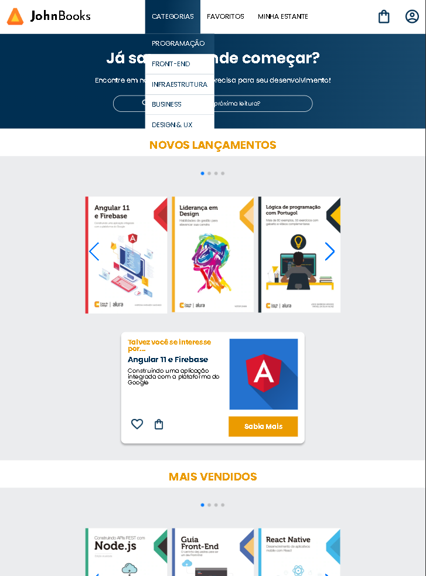
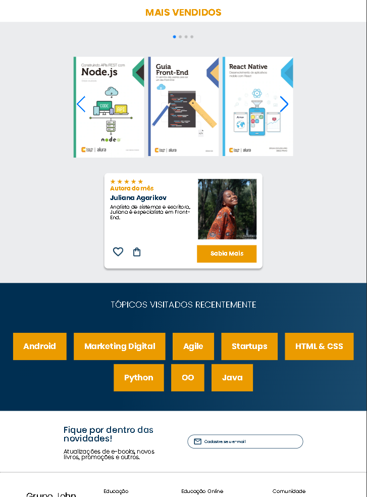
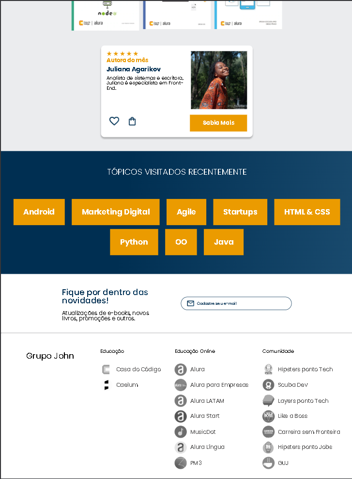

# 📚 JohnBooks

**JohnBooks** é um projeto prático de front-end criado com o objetivo de consolidar habilidades em **desenvolvimento web responsivo**, utilizando **HTML** e **CSS** de forma profissional.

Este projeto foi desenvolvido durante minha jornada de formação na **Alura**, e simula a página inicial de uma livraria online moderna. O foco está na criação de uma experiência fluida, elegante e intuitiva para o usuário — seja ele um leitor casual ou um apaixonado por tecnologia e literatura.

  

## ✨ Sobre o Projeto

Neste desafio, apliquei conceitos de **responsividade**, **componentização visual**, **interações com `hover`** e **estruturação semântica com HTML5**.  
O layout foi projetado cuidadosamente para oferecer:

- Experiência consistente em **diferentes dispositivos**: desktop, tablet e smartphone
- Navegação acessível, com foco em usabilidade e design centrado no usuário
- Organização de código com boas práticas, escalabilidade e clareza

Este projeto representa mais do que apenas uma interface bonita — ele expressa minha atenção aos **detalhes visuais**, à **estrutura técnica do CSS** e à **adaptação inteligente de conteúdos** para diversos tamanhos de tela.

## 🧠 Aprendizados e Competências Demonstradas

- Estruturação semântica com **HTML5**
- Design responsivo com **Media Queries**
- Utilização eficiente de **Flexbox** e **Grid Layout**
- Criatividade na construção de interfaces agradáveis
- Adaptação de imagens, textos e elementos interativos para diferentes resoluções
- Organização de projeto voltada para **portfólio profissional**

## 🌐 Tecnologias Utilizadas

- `HTML5`
- `CSS3`
- Media Queries
- Flexbox & Grid
- Responsividade Mobile First

## 📈 Status

✅ Projeto finalizado e disponível no GitHub  
🎯 Pronto para ser integrado ao portfólio e apresentado em entrevistas técnicas

## 💻 Exemplos Visuais

### 🖥️ Versão Desktop

  
   
  
   
  

---

### 📱 Versão Smartphone

  
  
  
  

---

### 📲 Versão Tablet

  
  
  
  
  

---
